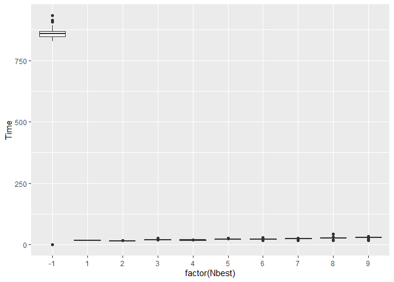
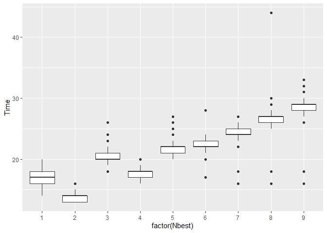
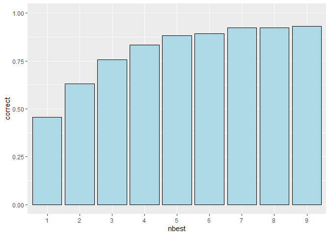

# QuickSearch-d

A program written in Dlang to choose a nearest point quickly.

## Overview

Consider we have a set of *D*-dimensional points
*S* = {*x*<sub>1</sub>, …, *x*<sub>*N*</sub>}. The nearest point search
is a task to find the point among *S* that is nearest to a given point
*y*;

*x̂* = arg min<sub>*x* ∈ *S*</sub>\|\|*x* − *y*\|\|<sup>2</sup>

The naive method examines all points in *S*. However, when *N* is large,
this operation takes a long time.

The cluster-based search first clusters the points in *S* into *M*
clusters, where *M* ≪ *N*. The quick search procedures first finds *K*
nearest points among the centroids of the clusters, and then examines
all points only in the nearest *K* clusters.

## Experiment

An experiment to measure time and accuracy of the implemented method.

### Experimental conditions

We created 100,000 points randomly, where one point was a 10-dimensional
vector. Then we created 100 clusters for doing the quick search. Then we
chose one point randomly, and found the nearest point from the
previously-generated 100,000 points. We iterated this experiment 103
times and took an average.

The computer was a linux server (Ubuntu 22.04 LTS) with Corei9-9820X
3.3GHz CPU and 96GB memory.

### Results
``` r
library(tidyverse)
```

    ── Attaching core tidyverse packages ──────────────────────── tidyverse 2.0.0 ──
    ✔ dplyr     1.1.4     ✔ readr     2.1.5
    ✔ forcats   1.0.0     ✔ stringr   1.5.1
    ✔ ggplot2   3.5.1     ✔ tibble    3.2.1
    ✔ lubridate 1.9.3     ✔ tidyr     1.3.1
    ✔ purrr     1.0.2     
    ── Conflicts ────────────────────────────────────────── tidyverse_conflicts() ──
    ✖ dplyr::filter() masks stats::filter()
    ✖ dplyr::lag()    masks stats::lag()
    ℹ Use the conflicted package (<http://conflicted.r-lib.org/>) to force all conflicts to become errors

``` r
x <- read.csv("out.csv")
```

Time to take for one search (microsecond); -1 means no cluster search
(the naive method)

``` r
x %>% ggplot(aes(x=factor(Nbest),y=Time))+geom_boxplot()
```



Time distribution of the n-best cluster search (in microsecond).
Increasing N results increased search time, but the absolute time
differences are small.

``` r
x %>% filter(Nbest>0) %>%
  ggplot(aes(x=factor(Nbest),y=Time))+geom_boxplot()
```



The correctness of the search result. Since this method is an
approximation, there is no guarantee to find the best solution. Trying
nine-best clusters, the correctness of the found solution is 93.2%.

``` r
x %>% filter(Nbest>0) %>%
  mutate(nbest=factor(Nbest)) %>%
  group_by(nbest) %>%
  summarise(correct=mean(Correct)) %>%
  ggplot(aes(x=nbest,y=correct))+
  geom_bar(stat="identity",position="dodge",fill="lightblue",col="black")+
  ylim(0,1)
```



``` r
x %>% filter(Nbest>0) %>%
  mutate(nbest=factor(Nbest)) %>%
  group_by(nbest) %>%
  summarise(correct=mean(Correct))
```

    # A tibble: 9 × 2
      nbest correct
      <fct>   <dbl>
    1 1       0.456
    2 2       0.631
    3 3       0.757
    4 4       0.835
    5 5       0.883
    6 6       0.893
    7 7       0.922
    8 8       0.922
    9 9       0.932
